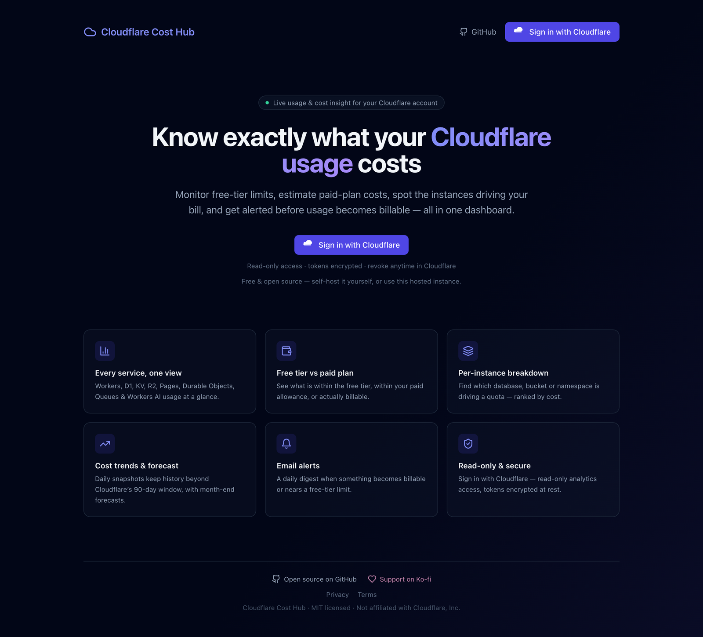
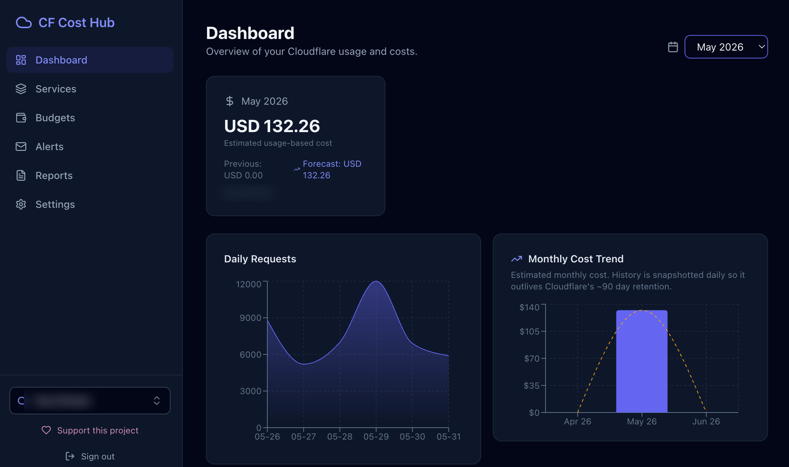
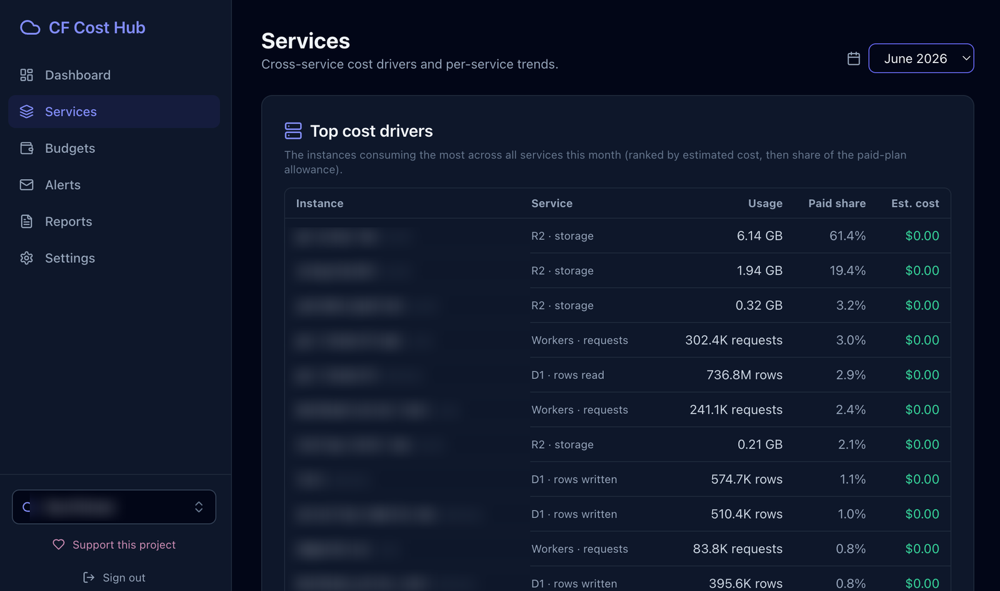
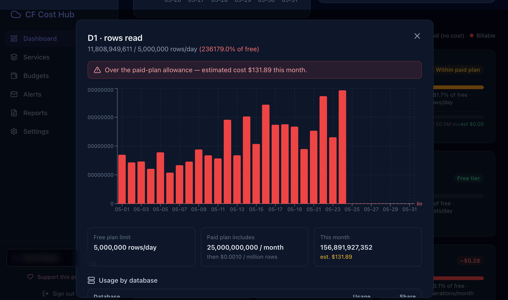

# Cloudflare Cost Hub

A dashboard to understand exactly what your Cloudflare usage costs. Sign in with
Cloudflare, and Cost Hub reads your account's analytics to show free-tier usage,
estimated paid-plan costs, the instances driving each quota, cost trends, and
email alerts — all in one place. Built entirely on the Cloudflare stack.

> [日本語版 README はこちら / Japanese README](./README.ja.md)

[](./LICENSE)
[](https://ko-fi.com/0xkaz)

**Free to self-host.** The hosted instance runs on donations — if it's useful,
[support the project on Ko-fi](https://ko-fi.com/0xkaz).

## Screenshots



**Dashboard** — estimated monthly cost, daily requests, free-tier status, and a month-end forecast.



**Services** — top cost drivers across every product, ranked by estimated cost and share of the paid-plan allowance.



**Per-instance detail** — drill into any metric to see free-tier vs paid-plan usage and the estimated cost.



<!-- Account and instance names are blurred in these captures; amounts are real. -->

## Features

- **Sign in with Cloudflare** (OAuth 2.0 + PKCE) — read-only analytics access, no API token to copy. Tokens are encrypted at rest.
- **Multi-account** — authorize several Cloudflare accounts and switch between them in-app.
- **All products in one view** — Workers, D1, KV, R2, Pages, Durable Objects, Queues, Workers AI (requests, rows, operations, storage, duration, neurons…).
- **Free tier vs paid plan, color-coded** — 🟢 within free tier · 🟡 over free but within the paid allowance (no cost) · 🔴 billable. The paid plan is auto-detected from your subscriptions when the token can read billing (requires a `Billing Read` API token; OAuth sign-in can't read billing, so detection is shown only when available).
- **Estimated cost & month-end forecast** — usage-based estimate against paid-plan included allowances, projected to month-end from the run-rate.
- **Per-instance breakdown** — click any metric to see which database / bucket / namespace / script / model drives it, ranked by cost and share of allowance (ids resolved to names).
- **Services view** — cross-service "top cost drivers" and per-service monthly trends.
- **Cost trend & history** — a daily snapshot keeps cost history beyond Cloudflare's ~90 day analytics retention (stored per account in D1 + R2). History is scoped per Cloudflare account.
- **Anomaly detection** — spike days highlighted on the usage chart.
- **Budgets** — set a monthly spend budget per account; the daily digest warns when the month-end forecast nears or exceeds it.
- **Usage-threshold alerts** — checked hourly: one e-mail when a metric's month-to-date usage reaches 20 / 40 / 50 / 70 / 80 / 90 % of the allowance included in the Workers Paid plan (configurable with `ALERT_THRESHOLDS`), once per threshold per month. `GET /api/dashboard/threshold-preview` (signed in) shows what the next run would report.
- **Email alerts** — a per-user daily digest (via Resend) when a metric is billable, nears its free-tier limit, or crosses a budget. Each connected account is snapshotted/alerted by the daily cron (multi-account fan-out), with per-user recipients and an enable toggle.
- **Reports** — export monthly cost history and current usage as CSV.

## Tech Stack

- React 18 + Vite + TypeScript + Tailwind CSS + Recharts (route-split, lazy-loaded chunks)
- Hono on Cloudflare Workers (single Worker serves the API and the SPA)
- D1 (users, tokens, snapshots, alert settings, budgets, account entitlements)
- R2 (durable daily snapshots, keyed per account)
- KV (stale-while-revalidate cache for computed dashboard/usage responses; optional)
- Durable Objects (alert deduplication scaffold)
- Cloudflare GraphQL Analytics + REST APIs
- Cloudflare OAuth (self-managed client) for sign-in
- Resend for email alerts

## Architecture

```
Browser ──HTTPS──▶  Cloudflare Worker (Hono)
                     ├─ /api/auth/cf/*     Cloudflare OAuth login (PKCE), session (JWT cookie)
                     ├─ /api/dashboard/*   usage, services, breakdown, trend, snapshot, alert-test
                     ├─ /api/settings/*    account/plan, per-user alert settings
                     ├─ /api/budgets       monthly budget (get/set/clear) + forecast status
                     ├─ /api/reports/*     CSV exports (cost history, usage)
                     └─ *                  serves the React SPA (Workers Sites)

Worker ──▶ Cloudflare GraphQL Analytics   (per-product usage)
Worker ──▶ Cloudflare REST API            (account list, plan, id→name resolution)
Worker ──▶ D1                             (users, cf_oauth_tokens [encrypted], snapshots,
                                           budgets, account_entitlements, alert settings)
Worker ──▶ R2                             (daily snapshot archive, keyed per account)
Worker ──▶ KV (CACHE)                     (SWR cache for dashboard/usage responses; optional)
Worker ──▶ Resend                         (daily alert email)
Cron (daily) ──▶ snapshot + alert digest for EVERY connected account (deduped fan-out)
```

Auth is two-layer by design but single sign-in: **Sign in with Cloudflare** both
authenticates the user (session) and authorizes read-only analytics access. The
access/refresh tokens are AES-GCM encrypted with `TOKEN_ENC_KEY` and stored per
user in D1; the data layer resolves the active account from the user's stored
token, falling back to env-configured credentials for the scheduled jobs.

Cost history and budgets are scoped per **Cloudflare account** (not per user),
so teammates who connect the same account share the same history. Alert delivery
preferences (recipient, on/off) stay per user. The app itself has no paid plan —
every feature is free (see [Self-hosting & supporting the project](#self-hosting--supporting-the-project)).

## Prerequisites

- Node.js 20+
- A Cloudflare account (Workers Paid recommended for full data)
- A Cloudflare [OAuth client](https://developers.cloudflare.com/fundamentals/oauth/create-an-oauth-client/)
- A [Resend](https://resend.com) API key (optional, for email alerts)

## Setup

1. Install dependencies and create your local config:

   ```bash
   npm install
   cp wrangler.example.toml wrangler.toml   # then fill in your own IDs (see the forking note below)
   ```

2. Create the D1 database and update `wrangler.toml` with the returned `database_id`:

   ```bash
   npx wrangler d1 create cloudflare-cost-hub-db
   ```

3. Apply migrations:

   ```bash
   npm run db:migrate
   ```

4. (Optional) Create a KV namespace for response caching and put its id in `wrangler.toml` (`CACHE` binding). The app works without it — it just recomputes on each request.

   ```bash
   npx wrangler kv namespace create CACHE
   ```

5. Create a Cloudflare OAuth client (Account → Manage Account → OAuth clients):
   - Grant type **Authorization Code**, token auth method **None (PKCE)** (public client) or a client secret (confidential).
   - Redirect URL: `https://<your-domain>/api/auth/cf/callback`
   - Required scopes: `Account Analytics Read`, `Account Settings Read`, `D1 Read`, `Workers KV Storage Read`, `Workers Scripts Read`
   - Optional: `Queues Read` (resolves queue instance names), `User Details Read` (real verified email — see `CF_OAUTH_EXTRA_SCOPES`).
   - Note: `Billing Read` is **not** offered to OAuth clients, so paid-plan auto-detection only works with a manually-issued API token.
   - For other people to connect their own accounts, make it a **public** client (requires DNS TXT domain verification).

6. Configure vars in `wrangler.toml` and secrets:

   ```bash
   # vars: CF_OAUTH_CLIENT_ID, CF_OAUTH_REDIRECT_URI, ALERT_EMAIL_FROM, ALERT_EMAIL_TO
   npx wrangler secret put SESSION_SECRET        # random string
   npx wrangler secret put TOKEN_ENC_KEY         # base64 32 bytes: openssl rand -base64 32
   npx wrangler secret put CF_OAUTH_CLIENT_SECRET # only for confidential clients
   npx wrangler secret put RESEND_API_KEY        # optional, for email alerts
   ```

7. Develop locally:

   ```bash
   make dev   # SPA on :5173 proxying the Worker on :8787
   ```

> **Forking note:** `wrangler.toml` is git-ignored; the repo ships
> `wrangler.example.toml` with placeholders instead. Copy it to `wrangler.toml`
> and fill in your own `routes` custom domain, `database_id`, `CACHE` namespace
> `id`, `CF_ACCOUNT_ID` / `CF_ACCOUNT_NAME`, `APP_URL`, and `CF_OAUTH_CLIENT_ID` /
> `CF_OAUTH_REDIRECT_URI`. Secrets are never committed (set them with
> `wrangler secret put`).

## Build & Deploy

```bash
make build
npm run deploy   # or: wrangler deploy
```

A daily cron (`0 1 * * *`) captures a cost snapshot and sends the alert digest.

## Commands

| Command        | Description                            |
| -------------- | -------------------------------------- |
| `make dev`     | Start frontend + Worker dev servers    |
| `make lint`    | Run ESLint                             |
| `make test`    | Run all Vitest tests (unit + e2e)      |
| `make test-e2e`| Run only the API e2e tests             |
| `make build`   | Build frontend and Worker              |
| `npm run deploy` | Build and deploy the Worker          |
| `npm run db:migrate` | Apply D1 migrations              |

## Project Structure

```
src/
├── client/                 # React SPA (Dashboard, Services, Budgets, Alerts, Reports, Settings, Login…)
├── server/
│   ├── index.ts            # Hono app + SPA fallback + cron (multi-account fan-out)
│   ├── cloudflare-api.ts   # GraphQL usage, pricing, free-tier cards, breakdown
│   ├── cloudflare-rest.ts  # account plan (accessible flag) + id→name resolution
│   ├── cf-oauth.ts         # Cloudflare OAuth (PKCE), token store, account resolver, identity
│   ├── services.ts         # cross-service analysis + top cost drivers
│   ├── snapshots.ts        # per-account snapshot + cost trend (read-only on request path)
│   ├── alerts.ts           # per-user daily digest (Resend) + budget banner + entitlement
│   ├── budgets.ts          # budget evaluation (pure)
│   ├── reports.ts          # CSV rendering (pure)
│   ├── cache.ts            # KV stale-while-revalidate cache
│   ├── crypto.ts           # AES-GCM token encryption
│   ├── routes/             # auth, cf-oauth, dashboard, settings, budgets, reports
│   └── db/                 # D1 data access (snapshots, budgets, account-entitlements, …)
└── shared/                 # Shared TypeScript types
migrations/                 # D1 schema migrations (0001…0014)
```

## Environment

Non-secret values live in `wrangler.toml` `[vars]`; secrets are set with
`wrangler secret put`. See `.env.example` for the full list.

| Variable | Kind | Description |
| --- | --- | --- |
| `CF_OAUTH_CLIENT_ID` | var | Cloudflare OAuth client id |
| `CF_OAUTH_REDIRECT_URI` | var | OAuth callback URL |
| `CF_OAUTH_CLIENT_SECRET` | secret | Confidential clients only (omit for PKCE) |
| `SESSION_SECRET` | secret | Signs session + OAuth-state cookies |
| `TOKEN_ENC_KEY` | secret | base64 32-byte AES-GCM key for stored tokens |
| `APP_URL` | var | Public base URL for links in alert emails (optional) |
| `RESEND_API_KEY` | secret | Email alerts (optional) |
| `ALERT_EMAIL_FROM` / `ALERT_EMAIL_TO` | var | Alert sender / fallback recipient (when no user has configured alerts) |
| `ALERTS_REQUIRE_PAYMENT` | var | Reserved hook for a future paid tier; unused and off by default (all features free) |
| `CF_OAUTH_EXTRA_SCOPES` | var | Extra OAuth scopes appended to the defaults, e.g. `user-details.read` for real verified email |
| `CF_ANALYTICS_TOKEN` / `CF_ACCOUNT_ID` / `CF_ACCOUNT_NAME` | secret/var | Fallback account for scheduled jobs |

The `CACHE` KV namespace is bound in `wrangler.toml` (not an env var); omit it to disable caching.

## Self-hosting & supporting the project

This project is **open source and free to self-host** — deploy it to your own
Cloudflare account and every feature works, including automated alerts
(`ALERTS_REQUIRE_PAYMENT` defaults to off).

A hosted instance is available for people who'd rather not run it themselves.
Keeping it online costs a little (cron + email), so if it's useful, consider
[**supporting the project on Ko-fi**](https://ko-fi.com/0xkaz). It's a
donation, not a paywall — nothing in the hosted app is gated behind payment.

> The codebase keeps an account-level entitlement model (`account_entitlements`,
> `ALERTS_REQUIRE_PAYMENT`) so a future operator *could* gate automated alerts
> behind a paid plan, but the reference deployment intentionally does not.

## FAQ

**Why not just use Cloudflare's own billing dashboard?**
Cloudflare's bill tells you the total; Cost Hub tells you *what's driving it*. It
shows per-instance cost drivers (which database, bucket, or script), free-tier vs
paid-plan allowance per metric (so you can see why over-free usage can still be
$0), a 90+ day history (Analytics only retains ~90 days), month-end forecasts,
spike detection, budgets, and email alerts — across every product in one view.

**Are the cost figures real?**
They're estimates based on published Cloudflare pricing, computed against your
paid-plan included allowances. Treat them as guidance, not a billing source of
truth — always verify against your Cloudflare invoice.

**Is it safe to connect my account?**
Sign-in uses Cloudflare OAuth with **read-only** scopes (no API token to copy).
Tokens are AES-GCM encrypted at rest, each user only ever sees their own connected
account, and you can revoke access anytime in Cloudflare (My Profile → Access
Management → Connected Applications). Want full control? Self-host it — every
feature is free.

**Do I need a paid Cloudflare plan to use it?**
No — you can monitor a free-plan account; the dashboard reads analytics that are
available on the free plan. Paid-plan cost attribution needs a `Billing Read` API
token, which OAuth sign-in can't grant, so it's shown only when available.
(Self-hosting the app itself uses Durable Objects, for which Workers Paid is
recommended — see Prerequisites.)

## Notes

- Cost figures are **estimates** based on published Cloudflare pricing and may differ from your actual invoice.
- Cloudflare Analytics retains ~90 days; older months come from stored per-account snapshots.
- Not affiliated with Cloudflare, Inc.

## License

MIT
